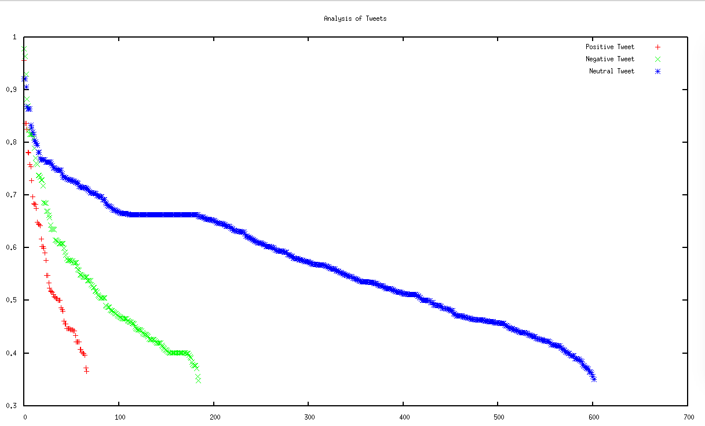

# Tweet Classifier

Learning-ception: I wanted to learn how to use Machine Learning and Natural Language Processing in practice.

This program can classify tweets on a topic (passed in argument) on 3 levels 'positive', 'negative' and 'neutral'.

# How to use the program

You must add a file `twitter4j.properties` at the root of the project.
In this file you must specify some informations from your app credential (https://apps.twitter.com/)
The file is looking as follow:

    debug                   = false
    oauth.consumerKey       = ********
    oauth.consumerSecret    = ********
    oauth.accessToken       = ********
    oauth.accessTokenSecret = ********

You also need to configure the token of your MonkeyLearn account in a file named `tokenClassifier'.

Then from the command `mvn compile install exec:java -Dexec.mainClass=Main` you can execute the program.

And with the command `mvn compile install exec:java -Dexec.mainClass=Main -Dexec.args="Trump"`
you can know what Twitter is globally thinking about the new PotUS ;)

    At the date of 05/06/2017 at 14:12, here is what Twitter was thinking about Trump:

    [0.956, 0.836, 0.836, 0.825, 0.781, 0.78, 0.758, 0.754, 0.728, 0.697, 0.684, 0.683, 0.683, 0.675, 0.649, 0.645, 0.644, 0.642, 0.617, 0.603, 0.603, 0.599, 0.59, 0.576, 0.548, 0.548, 0.533, 0.523, 0.518, 0.517, 0.516, 0.512, 0.507, 0.506, 0.504, 0.504, 0.501, 0.5, 0.5, 0.486, 0.483, 0.48, 0.461, 0.455, 0.455, 0.447, 0.447, 0.447, 0.447, 0.445, 0.444, 0.444, 0.442, 0.442, 0.433, 0.421, 0.421, 0.421, 0.421, 0.407, 0.407, 0.402, 0.4, 0.399, 0.396, 0.372, 0.366, -0.348, -0.356, -0.371, -0.376, -0.376, -0.376, -0.379, -0.383, -0.391, -0.393, -0.396, -0.399, -0.399, -0.399, -0.401, -0.401, -0.401, -0.401, -0.401, -0.401, -0.401, -0.401, -0.401, -0.401, -0.401, -0.401, -0.401, -0.401, -0.401, -0.401, -0.401, -0.401, -0.402, -0.404, -0.406, -0.406, -0.408, -0.41, -0.413, -0.415, -0.419, -0.419, -0.419, -0.419, -0.419, -0.421, -0.424, -0.426, -0.426, -0.426, -0.426, -0.426, -0.427, -0.431, -0.434, -0.435, -0.436, -0.436, -0.437, -0.439, -0.442, -0.443, -0.444, -0.444, -0.444, -0.446, -0.447, -0.45, -0.455, -0.456, -0.456, -0.459, -0.459, -0.46, -0.461, -0.462, -0.465, -0.465, -0.465, -0.465, -0.465, -0.466, -0.467, -0.469, -0.47, -0.471, -0.473, -0.475, -0.475, -0.477, -0.479, -0.481, -0.481, -0.482, -0.487, -0.487, -0.487, -0.489, -0.49, -0.505, -0.505, -0.505, -0.505, -0.505, -0.506, -0.508, -0.51, -0.516, -0.518, -0.518, -0.524, -0.524, -0.528, -0.53, -0.538, -0.538, -0.538, -0.538, -0.544, -0.544, -0.544, -0.544, -0.545, -0.548, -0.549, -0.549, -0.558, -0.559, -0.565, -0.572, -0.572, -0.572, -0.572, -0.575, -0.575, -0.576, -0.576, -0.576, -0.576, -0.58, -0.586, -0.592, -0.599, -0.608, -0.608, -0.608, -0.608, -0.608, -0.611, -0.613, -0.615, -0.615, -0.634, -0.635, -0.635, -0.635, -0.643, -0.657, -0.662, -0.67, -0.67, -0.685, -0.685, -0.686, -0.718, -0.729, -0.729, -0.734, -0.738, -0.738, -0.758, -0.76, -0.77, -0.789, -0.809, -0.815, -0.815, -0.815, -0.815, -0.823, -0.869, -0.882, -0.929, -0.964, -0.978]

    The strongest negative  :  -0.978
    The strongest positive  :   0.956
    The median value        :  -0.439
    The average value       :  -0.239

    Which can somehow be interpreted as 'globally, Twitter is against, but when people are for him, they are strongly for him'

The already trained classifier is : https://app.monkeylearn.com/main/classifiers/cl_qkjxv9Ly/tab/tree-sandbox/

# Credits

- [Twitter4J](http://twitter4j.org/en/index.html)
- [Gson](https://github.com/google/gson)
- [Twitter Apps](https://apps.twitter.com)
- [MonkeyLearn](https://monkeylearn.com/)
- [Maven](https://maven.apache.org/)

# Contact

Feel free to contact me on valentin.montmirail@gmail.com for more information

and/or to fork this program to add more features ;).

